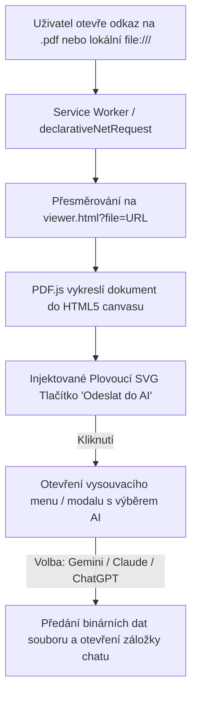

# Varianta B: Vlastní PDF Prohlížeč (PDF.js) s Plovoucím SVG Tlačítkem

Tento dokument detailně popisuje architekturu a technickou realizaci pro **Variantu B**, kde rozšíření nahrazuje nativní (uzavřený) prohlížeč PDF v prohlížeči Opera/Chrome vlastním HTML5 prohlížečem postaveným na knihovně [Mozilla PDF.js](https://mozilla.github.io/pdf.js/).

---

## 1. Proč je potřeba vlastní prohlížeč pro plovoucí tlačítko?

Chromium (Opera, Chrome, Brave, Edge) zobrazuje PDF soubory v interním, chráněném a izolovaném okně (`chrome-extension://mhjfbmdgcfjbbpaeojofohoefgiehjai/` nebo tag `<embed type="application/pdf">`). 
* Do tohoto nativního okna **není možné** přes klasický `content_scripts` injektovat žádné HTML elementy, SVG tlačítka ani JavaScriptové listenery.
* Pokud chceme mít **plovoucí interaktivní tlačítko přímo přes obsah PDF** v rohu obrazovky, musíme PDF renderovat v prostředí standardního DOM dokumentu (HTML5).

---

## 2. Architektura řešení



---

## 3. Komponenty a souborová struktura

Při přechodu na Variantu B by projekt obsahoval následující strukturu:

```
PDFImport/
├── manifest.json
├── background.js
├── pdfjs/
│   ├── pdf.mjs                 # Jádro PDF.js
│   ├── pdf.worker.mjs          # Web worker pro plynulé vykreslování
│   ├── viewer.html             # HTML obálka prohlížeče
│   ├── viewer.css              # Styly prohlížeče + plovoucího tlačítka
│   └── viewer.js               # Logika načtení PDF a obsluhy UI
├── content_gemini.js           # Content skript pro příjem a vložení souboru v Gemini
└── icons/
```

---

## 4. Implementační detaily

### 4.1. Přesměrování PDF požadavků (`manifest.json` + `background.js`)

Pomocí API `chrome.declarativeNetRequest` nebo `chrome.webNavigation.onBeforeNavigate` se zachytí URL končící na `.pdf`:

```javascript
// background.js
chrome.webNavigation.onBeforeNavigate.addListener((details) => {
    if (details.frameId === 0 && details.url.toLowerCase().endsWith('.pdf')) {
        const viewerUrl = chrome.runtime.getURL('pdfjs/viewer.html') + '?file=' + encodeURIComponent(details.url);
        chrome.tabs.update(details.tabId, { url: viewerUrl });
    }
});
```

### 4.2. Plovoucí SVG Tlačítko (`viewer.html` / `viewer.css`)

Do `viewer.html` se umístí plovoucí widget (Fab button) s moderními glassmorphism efekty:

```html
<div id="ai-floating-action" class="ai-fab-container">
    <button id="ai-fab-btn" class="ai-fab-btn" title="Odeslat do AI chatu">
        <!-- Moderní SVG ikona Sparkle / AI -->
        <svg width="24" height="24" viewBox="0 0 24 24" fill="none" stroke="currentColor" stroke-width="2">
            <path d="M12 2L15.09 8.26L22 9.27L17 14.14L18.18 21.02L12 17.77L5.82 21.02L7 14.14L2 9.27L8.91 8.26L12 2Z" />
        </svg>
    </button>
    
    <!-- Rozbalovací nabídka cílů -->
    <div id="ai-fab-menu" class="ai-fab-menu hidden">
        <button data-target="gemini" class="ai-menu-item">
            <span class="ai-badge">GEMINI</span> Google Gemini
        </button>
        <button data-target="claude" class="ai-menu-item">
            <span class="ai-badge">CLAUDE</span> Claude
        </button>
        <button data-target="chatgpt" class="ai-menu-item">
            <span class="ai-badge">GPT</span> ChatGPT
        </button>
    </div>
</div>
```

Styling plovoucího tlačítka:
```css
.ai-fab-container {
    position: fixed;
    bottom: 28px;
    right: 28px;
    z-index: 99999;
    display: flex;
    flex-direction: column-reverse;
    align-items: flex-end;
    gap: 12px;
}

.ai-fab-btn {
    width: 56px;
    height: 56px;
    border-radius: 50%;
    background: linear-gradient(135deg, #1a73e8, #8ab4f8);
    box-shadow: 0 4px 16px rgba(26, 115, 232, 0.4);
    border: none;
    color: white;
    cursor: pointer;
    display: flex;
    align-items: center;
    justify-content: center;
    transition: transform 0.2s cubic-bezier(0.4, 0, 0.2, 1), box-shadow 0.2s;
}

.ai-fab-btn:hover {
    transform: scale(1.08);
    box-shadow: 0 6px 20px rgba(26, 115, 232, 0.6);
}
```

### 4.3. Zpracování a odeslání do Gemini

Při kliknutí na tlačítko má `viewer.js` přímý přístup k načtenému souboru (buď původní URL, nebo lokální Blob/ArrayBuffer). Pošle zprávu na background worker:

```javascript
document.getElementById('ai-fab-btn').addEventListener('click', async () => {
    const urlParams = new URLSearchParams(window.location.search);
    const pdfUrl = urlParams.get('file');
    
    chrome.runtime.sendMessage({
        action: 'SEND_PDF_TO_AI',
        target: 'gemini',
        pdfUrl: pdfUrl
    });
});
```

---

## 5. Výhody a nevýhody Varianty B

| Výhody | Nevýhody |
|---|---|
| **100% vizuální integrace**: Plovoucí SVG tlačítko je přímo v okně dokumentu, přesně dle původní představy. | **Objemnější kód**: Vyžaduje zahrnutí PDF.js knihovny (~2-3 MB kód). |
| **Možnost označování textu**: Lze odeslat nejen celé PDF, ale např. jen označený odstavec nebo konkrétní kapitolu. | **Rychlost vykreslování**: Velká 500+ stránková PDF se v PDF.js mohou načítat o zlomek sekundy pomaleji než v C++ nativním Chromium prohlížeči. |
| **Volba více AI**: Snadné přidání tlačítek pro Claude, ChatGPT nebo lokální Ollama model. | Lokální `file:///` vyžaduje povolená oprávnění a správné předání do lokálního viewera. |

---

## 6. Doporučení pro budoucí rozšíření

Pokud se po otestování Varianty A (rychlé ovládání přes ikonu a zkratku `Alt+G`) rozhodnete přejít na Variantu B, je kód připraven modulárně – modul pro vkládání do Gemini (`content_gemini.js` a `background.js`) zůstává identický a stačí k němu pouze připojit HTML viewer s PDF.js.
