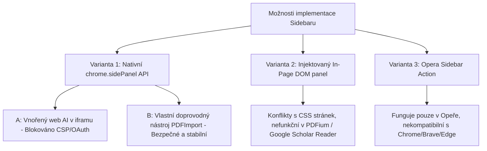
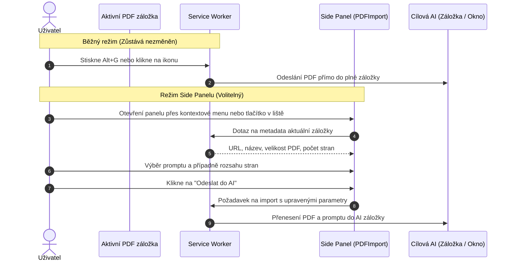

# Analýza a plán: Využití postranního panelu (Browser Sidebar) v PDFImport

Tento dokument detailně analyzuje možnosti integrace postranního panelu prohlížeče (Browser Sidebar / Side Panel) do rozšíření PDFImport. Posuzuje technickou proveditelnost, bezpečnostní a UX limity, soulad s filozofií projektu („Méně je někdy více“) a definuje strategický plán realizace.

---

## 1. Shrnutí a konečné stanovisko (Executive Summary)

### Otázka: Je dobrý nápad použít Browser Sidebar v PDFImport?

* **Jako hlavní / povinný způsob fungování: NE.**
  Základní hodnota PDFImport spočívá v bleskovém importu na 1 kliknutí nebo 1 klávesovou zkratku (`Alt + G`) bez jakýchkoliv mezikroků, konfigurací a zbytečného klikání. Nahrazení tohoto toku nutností nejdříve otevírat a ovládat sidebar by bylo v přímém rozporu s principem jednoduchosti a rychlosti.

* **Jako vložený webový chat s AI (ChatGPT, Claude, Gemini v iframu uvnitř sidebaru): VELMI RIZIKOVÉ A NEDOPORUČENÉ.**
  Většina velkých poskytovatelů AI striktně blokuje vkládání do rámců (CSP hlavičky `frame-ancestors 'none'`, `X-Frame-Options: DENY`, Cloudflare ochrana proti botům, selhání přihlašování přes Google/Apple OAuth a úzký viewport nevhodný pro komplexní webové aplikace).

* **Jako volitelný doprovodný panel (Optional Companion Panel): PODMÍNĚNĚ ANO (VHODNÉ PRO POKROČILÉ SCÉNÁŘE).**
  Pokud je postranní panel koncipován jako volitelný nástroj pro specifické úkoly (např. výběr rozsahu stránek pro velká PDF, volba vlastní prompt šablony před odesláním, historie nedávných importů, případně automatické dlaždicové uspořádání oken PDF + AI vedle sebe), přináší měřitelnou hodnotu pro náročné uživatele bez narušení základního 1-click toku.

---

## 2. Analýza uživatelských potřeb: Proč uživatelé chtějí sidebar?

Hlavní motivací pro postranní panel při práci s PDF a AI bývá:
1. **Práce s dokumentem a AI vedle sebe (Side-by-Side Context)**: Uživatel chce číst článek v hlavním okně a současně na téže obrazovce vpravo klást dotazy k textu, aniž by musel neustále přepínat mezi záložkami (`Ctrl + Tab`).
2. **Výběr kontextu před odesláním**: U rozsáhlých skript nebo knih (např. 200 stran) chce uživatel poslat do chatu pouze kapitolu 3 (strany 45–60) nebo konkrétní výňatek.
3. **Výběr systémového promptu**: Možnost předem zvolit, zda chce uživatel shrnutí, oponentní posudek, extrakci dat nebo Feynmanovu techniku.

---

## 3. Analýza architektonických variant

Při návrhu sidebaru v prostředí Chromium / Opera existují tři technické přístupy:



### Varianta 1: Nativní Chromium `chrome.sidePanel` API (Manifest V3)

Standardní API představené v Chromiu 114+ (plně podporováno v Chrome, Brave, Edge i novějších verzích Opery).

#### Podvarianta 1A: Zobrazení webového chatu (ChatGPT, Claude, Gemini) přímo v panelu
* **Koncept**: Postranní panel otevře přímo stránku vybrané AI a uživatel v něm komunikuje.
* **Technická realita**:
  1. **Bezpečnostní blokace (CSP & Framing)**:
     Weby `chatgpt.com`, `claude.ai` a `gemini.google.com` vracejí hlavičky:
     `Content-Security-Policy: frame-ancestors 'none';` a `X-Frame-Options: DENY`.
  2. **Obcházení přes `declarativeNetRequest`**:
     Rozšíření může teoreticky tyto hlavičky odstraňovat. V praxi však okamžitě nastávají další bariéry:
     * **Autentizace / SSO**: Přihlášení přes Google účet nebo Apple ID v iframu selže (Google Identity Services striktně odmítá běh v iframu kvůli clickjacking ochraně).
     * **Cloudflare / Turnstile / Bot Protection**: Cloudflare detekuje nestandardní kontext iframu a zobrazí nekonečnou CAPTCHA smyčku.
     * **Responsivita**: Weby jako Claude s postranními artefakty nebo ChatGPT nejsou optimalizovány pro šířku 320–400 px, což vede k rozpadu ovládacích prvků.
* **Verdikt**: **Nedoporučeno.** Způsobilo by časté stížnosti uživatelů na nefunkční přihlášení a rozbité rozhraní po každé aktualizaci cílových AI webů.

#### Podvarianta 1B: Vlastní doprovodný panel PDFImport (Companion Panel)
* **Koncept**: V postranním panelu běží čistá interní stránka rozšíření (`src/sidebar/sidebar.html`), která komunikuje se service workerem a aktivní záložkou.
* **Funkce panelu**:
  * Detekce aktuálního PDF v aktivní záložce (název, velikost, počet stran, odhad tokenů).
  * Výběr cílové platformy (Claude, ChatGPT, Gemini, atd.) jedním kliknutím.
  * Výběr předdefinovaného nebo vlastního promptu (Shrnutí, Klíčové body, Kritická oponentura).
  * Nástroj pro oříznutí / výběr stránek pro velká PDF překračující limity.
  * Tlačítko „Odeslat do AI“ (s volbou: otevřít v nové záložce / rozdělit okno).
  * Historie posledních 10 odeslaných dokumentů s časovými razítky a rychlým odkazem.
* **Technická stabilita**: **Vysoká.** Běží v bezpečném kontextu rozšíření bez rizika blokace externími službami.
* **Verdikt**: **Technicky čisté, stabilní a přínosné řešení.**

---

### Varianta 2: In-Page Floating Sidebar (Injektovaný panel do DOM stránky)

* **Koncept**: Content script injektuje do pravé části webové stránky vysouvací lištu (např. pomocí Shadow DOM).
* **Kritické nedostatky**:
  * **Nativní prohlížeč PDF (PDFium)**: Do vestavěného prohlížeče PDF v Chromiu (`chrome://pdf-viewer` nebo nativní binární zobrazení) nelze z bezpečnostních důvodů injektovat žádné content scripty.
  * **Externí čtečky (Google Scholar PDF Reader)**: Cizí iframe `chrome-extension://` neumožňuje injektáž skriptů ani stylů.
  * **Kolize s obsahem webu**: Injektovaný panel zmenšuje čtecí plochu nebo překrývá obsah originální stránky.
* **Verdikt**: **Zcela nevhodné pro PDF rozšíření.**

---

### Varianta 3: Nativní Opera Sidebar (`opera.sidebarAction`)

* **Koncept**: Opera disponuje specifickým panelem na levé straně okna.
* **Limity**:
  * Funguje výhradně v prohlížeči Opera; v Chrome, Brave a Edge není dostupné.
  * Opera již obsahuje vlastní AI panel (Aria) a webové panely, které si uživatel může přidat sám.
* **Verdikt**: **Nedoporučeno jako primární řešení.** Omezilo by multiplatformnost doplňku. Standardem je `chrome.sidePanel`.

---

## 4. Srovnávací matice řešení

| Kritérium | Současný 1-Click Import | Side Panel: Web AI v iframu | Side Panel: PDFImport Companion | Split-Window (Dlaždice) |
| :--- | :--- | :--- | :--- | :--- |
| **Rychlost použití** | Okamžitá (1 klik / zkratka) | Střední (načítání chatu) | Střední (volba parametrů) | Okamžitá (automatické rozložení) |
| **Čtení PDF a AI vedle sebe** | Ne (přepnutí záložky) | Ano (v úzkém pruhu) | Ne (v panelu jsou jen volby) | Ano (plnohodnotná 2 okna 50:50) |
| **Spolehlivost / Stabilita** | Velmi vysoká | Velmi nízká (CSP, CAPTCHA, SSO) | Velmi vysoká (interní kód) | Velmi vysoká (nativní okna OS/Chromia) |
| **Kompatibilita s PDFium a Scholar** | 100 % | 100 % | 100 % | 100 % |
| **Složitost údržby** | Nízká | Extrémní (změny cizích webů) | Nízká | Velmi nízká |
| **Soulad s pravidlem „Méně je více“** | Maximální | Nízký (vizuální zmatek) | Střední (opt-in nastavení) | Vysoký (přirozené chování OS) |

---

## 5. Zhodnocení: Je to dobrý nápad?

### Závěr analýzy:

1. **Vytvoření postranního panelu s vloženým ChatGPT / Claude / Gemini je past.**
   Bude neustále selhávat na autorizaci Google účtů, detekci robotů Cloudflare a změnách zabezpečení poskytovatelů AI. Uživatelé by získali nespolehlivý zážitek.

2. **Vynucení sidebaru jako výchozího toku by poškodilo projekt.**
   Uživatelé milují PDFImport pro rychlost: otevřu PDF, zmáčknu `Alt + G`, hotovo. Jakékoliv mezikroky v sidebaru tuto výhodu stírají.

3. **Kde má sidebar skutečný smysl:**
   Jako **volitelný nástroj pro přípravu a dávkovou práci s rozsáhlými dokumenty** (výběr kapitol z knih, rychlá volba šablony promptu bez nutnosti chodit do Options, kontrola velikosti a počtu stran).

4. **Alternativa pro práci „Side-by-Side“: Režim Split-Window (Dlaždice)**
   Namísto riskantního iframu v sidebaru může rozšíření nabídnout volbu:
   * **Režim zobrazení cíle**:
     * A: Otevřít / přepnout v jedné záložce (současné výchozí chování).
     * B: Rozdělit obrazovku vedle sebe (Split-Screen / Tile Windows): Rozšíření automaticky upraví šířku okna s PDF na 50 % obrazovky vlevo a okno s cílovou AI umístí na 50 % vpravo. Obě aplikace běží ve svých plnohodnotných oknech bez jakýchkoliv omezení CSP, CAPTCHA či SSO.

---

## 6. Realizační plán (Pokud bude schválena implementace Side Panelu)

Tento plán popisuje modulární implementaci volitelného panelu `chrome.sidePanel` bez narušení stávající funkčnosti.



### Fáze 1: Příprava manifestu a oprávnění

* **Soubory**: `manifest.json`, `debug-extension/manifest.json`
* **Změny**:
  1. Přidat oprávnění `"sidePanel"` do pole `permissions`.
  2. Deklarovat konfiguraci postranního panelu:
     ```json
     "side_panel": {
       "default_path": "src/sidebar/sidebar.html"
     }
     ```
  3. Zajistit dynamické otevírání: v `src/background.js` nakonfigurovat `chrome.sidePanel.setPanelBehavior({ openPanelOnActionClick: false })`, aby kliknutí na ikonu stále primárně provádělo rychlý import (nebo dle uživatelské volby v Options).

### Fáze 2: Uživatelské rozhraní postranního panelu (`src/sidebar/`)

* **Struktura**:
  * `src/sidebar/sidebar.html`
  * `src/sidebar/sidebar.css`
  * `src/sidebar/sidebar.js`
* **Vizuální styl**:
  * Přísné dodržení designových pravidel projektu: čistý, minimalistický, funkční design.
  * Zákaz emotikonů; použití čistých SVG ikon.
  * Respektování světlého i tmavého režimu prohlížeče.
* **Komponenty rozhraní**:
  1. **Záhlaví**: Název dokumentu a indikátor typu (lokální soubor vs. webové URL).
  2. **Karta dokumentu**: Velikost souboru, odhad počtu stran, stav optimalizace.
  3. **Rychlá volba AI**: Ikony podporovaných platforem s okamžitým přepnutím aktivního cíle.
  4. **Výběr promptu**: Rozbalovací seznam nebo rychlé štítky předdefinovaných promptů (Klíčové body, Shrnutí, Oponentura, Vlastní text).
  5. **Rozsah stran (volitelné)**: Pole pro zadání stránek (např. `1-10, 15`), pokud uživatel nechce posílat celé PDF.
  6. **Hlavní akční tlačítko**: „Importovat do [Název AI]“.

### Fáze 3: Komunikační vrstva Service Workeru

* **Soubor**: `src/background.js`
* **Změny**:
  1. Posluchač zpráv pro panel: obsluha požadavků `GET_CURRENT_PDF_INFO` a `DISPATCH_SIDEBAR_IMPORT`.
  2. Podpora pro částečnou extrakci stránek přes existující offscreen modul (využití PDF.js / PDF-lib pro vyříznutí požadovaných stránek před předáním do AI).
  3. Volitelná akce v kontextovém menu: „Otevřít postranní panel PDFImport“.

### Fáze 4: Integrace do Možností (Options)

* **Soubory**: `src/options/options.html`, `src/options/options.js`
* **Nové volby**:
  1. **Výchozí akce kliknutí na ikonu**:
     * Přímý import (výchozí, doporučeno pro rychlost).
     * Otevřít postranní panel PDFImport.
  2. **Režim zobrazení AI po importu**:
     * Běžná záložka (výchozí).
     * Rozdělit obrazovku vedle sebe (Split Windows 50:50).

---

## 7. Doporučený další postup

1. **Neimplementovat vnořený web AI do panelu**: Vyhnout se pokusům o vkládání ChatGPT/Claude do iframu v sidebaru z důvodu bezpečnostních a technických blokací.
2. **Prioritně zvážit funkci Split-Screen (Dlaždice)**: Nabídnout uživatelům možnost automatického umístění PDF vlevo a AI vpravo na 1 kliknutí jako čistou alternativu bez nutnosti vytvářet složitý sidebar.
3. **Ponechat Companion Sidebar jako volitelný rozšiřující modul**: Pokud je žádána možnost podrobné konfigurace před odesláním velkých dokumentů, realizovat Fáze 1 až 4 výhradně jako volitelnou funkci (`opt-in`), aby základní minimalistický a bleskový zážitek zůstal stoprocentně zachován.
