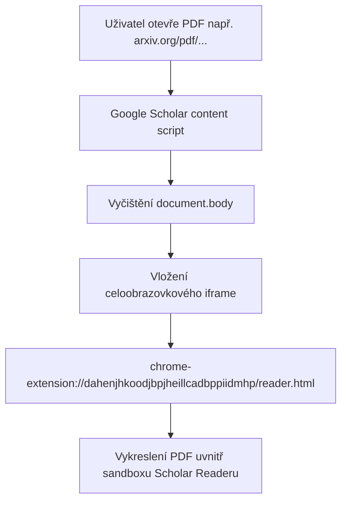

# Technický plán podpory pro externí PDF prohlížeče (Google Scholar PDF Reader)

Tento dokument detailně analyzuje chování a architekturu externích rozšíření pro čtení PDF dokumentů (se zaměřením na **Google Scholar PDF Reader**, ID `dahenjhkoodjbpjheillcadbppiidmhp`) a definuje technický plán realizace plné kompatibility v rozšíření PDFImport.

---

## 1. Současný stav a podstata problému

Při běžném prohlížení PDF dokumentů na webu nebo z disku vykresluje Chromium stránku buď pomocí nativního PDF modulu (PDFium), nebo předává řízení specializovaným rozšířením. 

Oficiální rozšíření **Google Scholar PDF Reader** při detekci PDF dokumentu provádí následující transformaci:
1. Injektuje content script `contentscript-compiled.js` s časováním `document_start` do hlavní stránky.
2. Odstraní původní obsah `document.body` a vloží celoobrazovkový prvek `<iframe>` s absolutním pozicováním:
   ```html
   <iframe src="chrome-extension://dahenjhkoodjbpjheillcadbppiidmhp/reader.html" 
           style="width: 100%; height: 100%; position: absolute; left: 0; top: 0; border: none;">
   </iframe>
   ```
3. Samotné PDF je staženo a vykresleno uvnitř tohoto izolovaného rámce `chrome-extension://`.



### Omezení plynoucí z bezpečnostního modelu Chromia

* **Izolace kontextu rámce**: Veškeré kliknutí myší (levé i pravé) směřují do dokumentu s protokolem `chrome-extension://`.
* **Filtrování kontextových nabídek (`documentUrlPatterns`)**: Chromium vyhodnocuje pravidla pro zobrazení položek kontextové nabídky proti URL adrese rámce, v němž došlo ke kliknutí. Pokud jsou nastavena pravidla pro `*://*/*.pdf`, rámec s adresou `chrome-extension://...` těmto pravidlům nevyhovuje a Chromium položku nezobrazí.
* **Ochrana interních URL (`isRestrictedUrl`)**: Pokud by rozšíření převzalo adresu rámce jako cíl pro stažení, interní ochrana ji vyhodnotí jako nepovolenou a otevře stránku možností.
* **Zákaz cizích content scriptů**: Do stránek a rámců cizích doplňků (`chrome-extension://`) nesmí žádné jiné rozšíření injektovat vlastní skripty ani CSS styly.

---

## 2. Co funguje spolehlivě již nyní

Jelikož Google Scholar PDF Reader nemění URL adresu v adresním řádku prohlížeče (`tab.url`), adresa záložky stále odkazuje na původní zdrojový dokument (např. `https://arxiv.org/pdf/2301.12345.pdf`):

1. **Klávesová zkratka `Alt + G`**:
   Operuje přímo na úrovni aktivní záložky (`tab.url`), nikoliv přes kontextový prvek v DOM. Zkratka funguje spolehlivě i při otevřeném Scholar Readeru.
2. **Kliknutí na ikonu rozšíření v liště prohlížeče**:
   Spouští posluchač `chrome.action.onClicked`, který čte `tab.url` a okamžitě spouští proces importu.
3. **Kontextové menu na odkazech**:
   Kliknutí pravým tlačítkem na odkaz na PDF (např. přímo ve vyhledávači Scholar před otevřením) nabízí položku "Odeslat odkazované PDF" a funguje bez omezení.

---

## 3. Technický plán realizace podpory

Cílem plánu je zajistit, aby uživatel mohl importovat PDF i prostřednictvím pravého tlačítka myši přímo uvnitř okna Google Scholar PDF Readeru a obdobných doplňků (např. Adobe Acrobat).

### Fáze 1: Úprava registrace kontextového menu v Service Workeru

* **Cíl**: Zpřístupnit položku kontextového menu i pro rámce Google Scholar Readeru.
* **Implementace**:
  1. Do pole vzorů `PDF_PATTERNS` v souboru [src/background.js](file:///e:/Coding/Antigravity%20IDE%20Projects/PDFImport/src/background.js) doplnit specifické vzory pro známé PDF čtečky:
     ```javascript
     const EXTENSION_READER_PATTERNS = [
       "chrome-extension://dahenjhkoodjbpjheillcadbppiidmhp/*", // Google Scholar PDF Reader
       "chrome-extension://efaidnbmnnnibpcajpcglclefindmkaj/*"  // Adobe Acrobat Extension
     ];
     ```
  2. V režimu kontextového zobrazení (Mode 2) spojit vzory:
     ```javascript
     documentUrlPatterns: [...PDF_PATTERNS, ...EXTENSION_READER_PATTERNS]
     ```
  3. Ověřit, že Chromium akceptuje specifické match patterny rozšíření bez syntaktické chyby při volání `chrome.contextMenus.create`.

### Fáze 2: Adaptivní detekce cílové URL v obsluze `contextMenus.onClicked`

* **Cíl**: Pokud uživatel klikne uvnitř rámce čtečky, nepoužít adresu `chrome-extension://`, ale extrahovat skutečné PDF z nadřazené záložky.
* **Implementace**:
  1. V obslužné funkci `chrome.contextMenus.onClicked` analyzovat vlastnosti `info.frameUrl` a `info.pageUrl`.
  2. Implementovat detekci známého rámce:
     ```javascript
     function isKnownExtensionReaderFrame(frameUrl) {
       if (!frameUrl) return false;
       return frameUrl.startsWith("chrome-extension://dahenjhkoodjbpjheillcadbppiidmhp/") ||
              frameUrl.startsWith("chrome-extension://efaidnbmnnnibpcajpcglclefindmkaj/");
     }
     ```
  3. Pokud událost přišla z takového rámce, nastavit `targetUrl = tab.url` (nebo `info.pageUrl`) a přeskočit vyhodnocení `isRestrictedUrl` pro samotný rámec:
     ```javascript
     if (isKnownExtensionReaderFrame(info.frameUrl)) {
       targetUrl = tabUrl || pageUrl;
     }
     ```
  4. Předat `targetUrl` standardnímu stahovacímu řetězci `processPdfUrl()`.

### Fáze 3: Rozšíření heuristiky `isTabPdf` pro detekci čteček

* **Cíl**: Zajistit spolehlivou detekci otevřeného PDF pro potřeby tlačítka na liště a aktualizace viditelnosti menu (`updateTabContextMenu`).
* **Implementace**:
  1. V souboru `src/background.js` ve funkci `isTabPdf` rozšířit injektovanou kontrolu o přítomnost iframe Scholar Readeru v hlavním dokumentu:
     ```javascript
     const hasScholarIframe = !!document.querySelector('iframe[src*="dahenjhkoodjbpjheillcadbppiidmhp"]');
     const hasAcrobatIframe = !!document.querySelector('iframe[src*="efaidnbmnnnibpcajpcglclefindmkaj"]');
     return document.contentType === "application/pdf" ||
            hasScholarIframe ||
            hasAcrobatIframe ||
            !!document.querySelector('embed[type="application/pdf"]');
     ```

### Fáze 4: Top-Level plovoucí SVG indikátor (Volitelné / Experimentální)

* **Cíl**: Zobrazit malé, decentní tlačítko přímo přes čtečku bez zásahu do vnitřního sandboxovaného iframe.
* **Analýza proveditelnosti**:
  * Protože náš content script `src/content_links.js` běží na úrovni hlavního dokumentu (`top frame`), může přistupovat k `document.documentElement` hlavní stránky.
  * Lze vytvořit lehký overlay kontejner v pravém dolním rohu:
    ```javascript
    const overlay = document.createElement("div");
    overlay.className = "pdfimport-scholar-overlay";
    overlay.style.cssText = "position:fixed;bottom:24px;right:24px;z-index:2147483647;pointer-events:auto;";
    ```
  * **Zhodnocení UX**: V souladu s pravidlem "méně je někdy více" by toto tlačítko mělo být volitelné a ve výchozím stavu decentní (např. malý minimalistický SVG symbol s tooltipem), aby nerušilo čtení vědeckého textu.

---

## 4. Matice kompatibility a rizik

| Scénář | Současné chování | Chování po realizaci plánu |
| :--- | :--- | :--- |
| **Klávesová zkratka Alt+G** | Plně funkční | Plně funkční |
| **Ikona rozšíření na liště** | Plně funkční | Plně funkční |
| **Pravé tlačítko v Scholar Readeru (Mode 1)** | Otevře Možnosti (chyba URL) | Správně odešle PDF do AI |
| **Pravé tlačítko v Scholar Readeru (Mode 2)** | Položka se nezobrazí | Položka se korektně zobrazí a odešle PDF |
| **Plovoucí tlačítko uvnitř textu** | Blokováno pískovištěm | Možné přes top-level overlay |

### Bezpečnostní a technická rizika

1. **Změna ID rozšíření Scholar Readeru**:
   Google může v budoucnu změnit ID rozšíření nebo způsob vkládání iframe. Řešením je udržovat ID v přehledné konfigurační konstantě a kontrolovat i obecnější patterny.
2. **Přístup k lokálním souborům (`file:///`)**:
   Pokud uživatel otevře lokální PDF ve Scholar Readeru, musí mít obě rozšíření povoleno "Allow access to file URLs" v nastavení prohlížeče.

---

## 5. Doporučený postup nasazení

1. **Verze 1.4.2** (aktuální stav):
   * Doplněna uživatelská dokumentace a upozornění do `README.md` i `README.cs.md`.
   * Vytvořen tento detailní architektonický plán.
2. **Verze 1.5.0** (následující minor verze):
   * Implementace Fáze 1, Fáze 2 a Fáze 3 v `src/background.js`.
   * Testování v prostředích Opera, Google Chrome a Brave s aktivním doplňkem Google Scholar PDF Reader.
