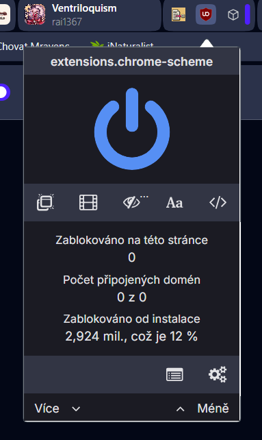

# TODOLIST

* [ ]  přidat podporu pro import do Claude, Grok, ChatGPT, Meta, DeepSeek a dalších - přidat do nastavení, upravit texty v nastavení, není to už jen pro gemini
* [ ]  když kliknu na toolbar icon a jsem zrovna mimo otevřené pdfko, tak ať se zobrazí miniaturní stránka pro nastavení rozšíření nebo celá stránka, idk jestli to jde nějak ,třeba jako to má ublock origin

  
* [ ]  přidat
